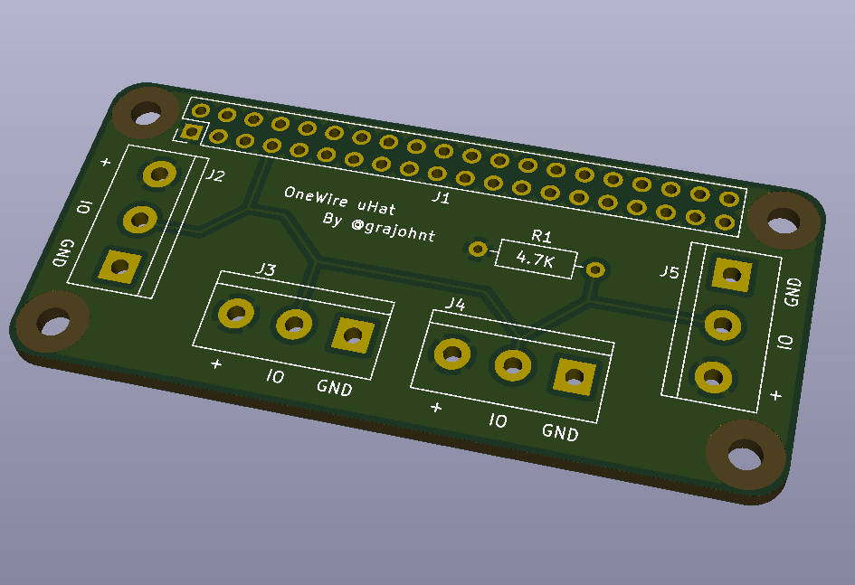

# Raspberry Pi OneWire uHat

This is a very simple uHat for the [Raspberry Pi Zero](https://www.raspberrypi.org/products/pi-zero/) sized uHat. It uses the [very nice template](https://github.com/mikelawrence/RPi_Zero_pHat_Template) from Mike Lawrence.

The purpose of this board is to simply allow connection of OneWire sensors (such as temperature sensors) that require a 4.7K pullup resistor. 

Connect up to four 5.08mm pitch terminal blocks. It should be possible to even put multiple sensors into the same terminal block.

